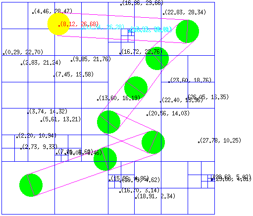

# IPRF - « QuadTree »

This is a project I made during my fourth and fifth semester at [ENSIIE](http://www.ensiie.fr). It is a collision detection system written in OCaml using the 
[QuadTree](http://wikipedia.org/wiki/Quadtree) data structure.

## Installation
Just clone this repo : `git clone http://git.quba.fr/ENSIIE/IPRF/quadtree.git`.

## Usage
Go to the repo's `src/` directory and run `ocaml graphics.cma part5.test.ml`.  

## License
The following files are © Christophe Mouilleron, the module's teacher :  
- `subject.pdf`  
- `src/display.ml`  
- `src/simulation1.ml`  
- `src/simulation2.ml`  

All the other files in the repo are placed under the terms of the [MIT License](LICENSE).
